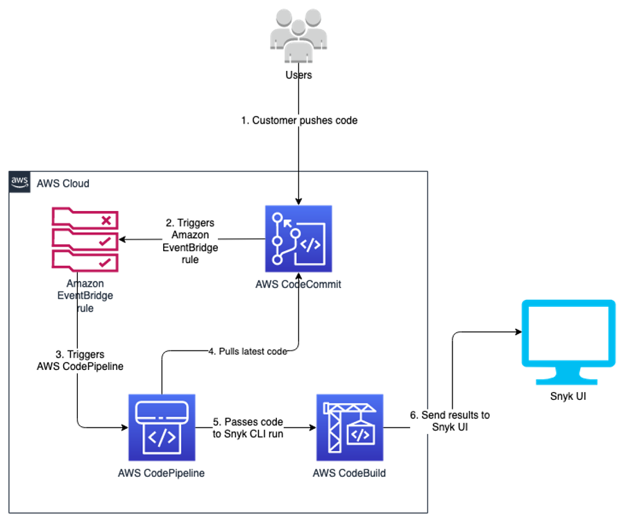

# Welcome to Snyk Python SCA Scanning CDK Construct!

## What does this CDK construct provide?
This CDK construct uses Snyk CLI to scan Python packages for open source package vulnerabilities. The construct builds AWS CodePipeline to create a two-stage pipeline -- one source, and one build (Snyk scan stage). The construct takes input of the CodeCommit repository you want to scan, the Snyk organization ID, and Snyk Auth token.


### Resources Deployed
The following resources are deployed by this construct:
- AWS::Events::Rule = Used for triggering CodePipeline from commit made to particular branch
- AWS::CodeBuild::Project
- 4 AWS::IAM::Role with inline policies
    - `events.amazonaws.com` triggers CodePipeline
    - `codepipeline.amazonaws.com` access to pipeline's artifact S3 bucket, KMS key, assuming the pipeline's stages' roles
    - starting and stopping CodeBuild project created in this construct
    - permissions to push to S3 artifact bucket, ability to encrypt and decrypt using the KMS Key, CodeCommit GetBranch, GetCommit, UploadArchive actions 
- AWS::CodePipeline::Pipeline
- AWS::S3::Bucket
- AWS::KMS::Key
- AWS::KMS::Alias

## Architecture Diagram



## What is in this repo?
For the purpose of deployment, this construct has been used in a stack. The construct requires the following parameters to deploy :
1. ARN of the CodeCommit repo you want to scan
2. Branch of the repo you want the EventBridge rule to trigger on
3. Parameter Store name of Snyk Org ID
4. Parameter Store name for Snyk Auth Token

Number 3 and 4 should be setup before the stack is deployed. As these are confidential/sensitive data, it should be deployed via separate stack and/or process.

Depending on the structure of your CodeCommit repo, you can edit the `buildspec.yml` within the `cdk_snyk_construct_stack.py` file. 
> Note: I am looking into ways to make this more dynamic so that the user just deploys the construct and the code automatically find out which file to scan for. If you have any ideas please ping bdds@ 


## FAQ
- *What should I do if I had to scan other languages?*
<br />Currently, this code is build to scan for pip packages, ergo Python language. If your use case has other languages, feel free to modify the construct's buildspec to match Snyk's recommendations. (Reference: https://support.snyk.io/hc/en-us/articles/360003812578-CLI-reference)
- *Do I need to buy Snyk to get this working?*
<br />No. Snyk provides Snyk CLI on its free version. You only need to signup for a free Snyk account.
- *What is Snyk organization ID?*
<br />Within the realm of Snyk, "organization" means a container for projects/code repos. This will influence where will new projects be created after running scans, some features availability and private tests limits.
- *What is Snyk Auth token?*
<br />This token is used to authenticate our CodePipeline (without any user interaction) with our Snyk organization.


## CDK Fundamentals
The `cdk.json` file tells the CDK Toolkit how to execute your app.

This project is set up like a standard Python project.  The initialization
process also creates a virtualenv within this project, stored under the `.venv`
directory.  To create the virtualenv it assumes that there is a `python3`
(or `python` for Windows) executable in your path with access to the `venv`
package. If for any reason the automatic creation of the virtualenv fails,
you can create the virtualenv manually.

To manually create a virtualenv on MacOS and Linux:

```
$ python3 -m venv .venv
```

After the init process completes and the virtualenv is created, you can use the following
step to activate your virtualenv.

```
$ source .venv/bin/activate
```

If you are a Windows platform, you would activate the virtualenv like this:

```
% .venv\Scripts\activate.bat
```

Once the virtualenv is activated, you can install the required dependencies.

```
$ pip install -r requirements.txt
```

At this point you can now synthesize the CloudFormation template for this code.

```
$ cdk synth
```

To add additional dependencies, for example other CDK libraries, just add
them to your `setup.py` file and rerun the `pip install -r requirements.txt`
command.

## Useful commands

 * `cdk ls`          list all stacks in the app
 * `cdk synth`       emits the synthesized CloudFormation template
 * `cdk deploy`      deploy this stack to your default AWS account/region
 * `cdk diff`        compare deployed stack with current state
 * `cdk docs`        open CDK documentation

Enjoy!


## Security

See [CONTRIBUTING](CONTRIBUTING.md#security-issue-notifications) for more information.

## License

This library is licensed under the MIT-0 License. See the LICENSE file.